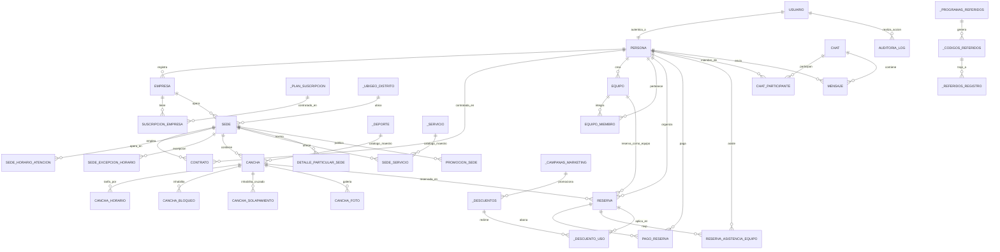
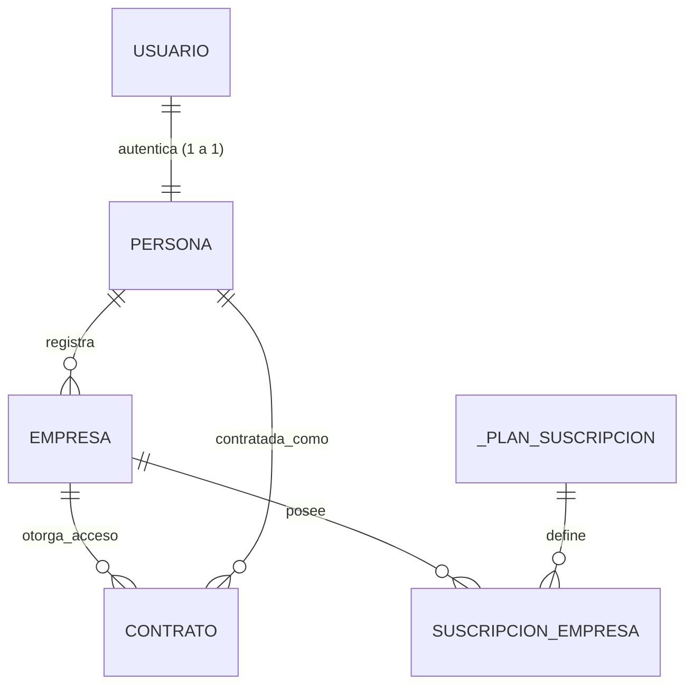
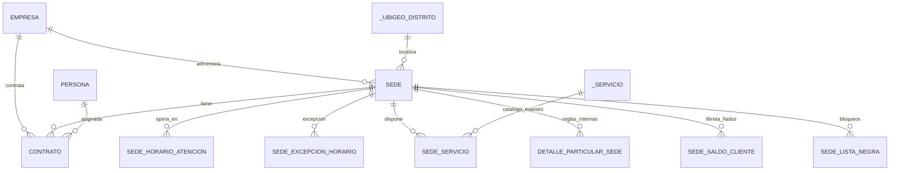
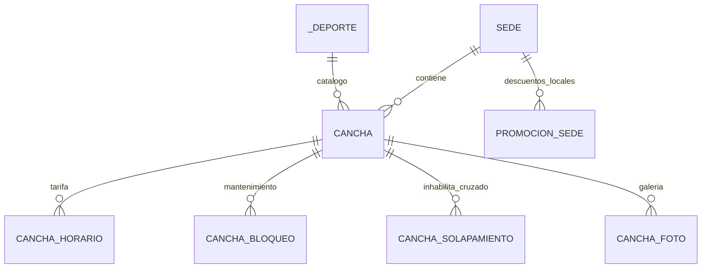
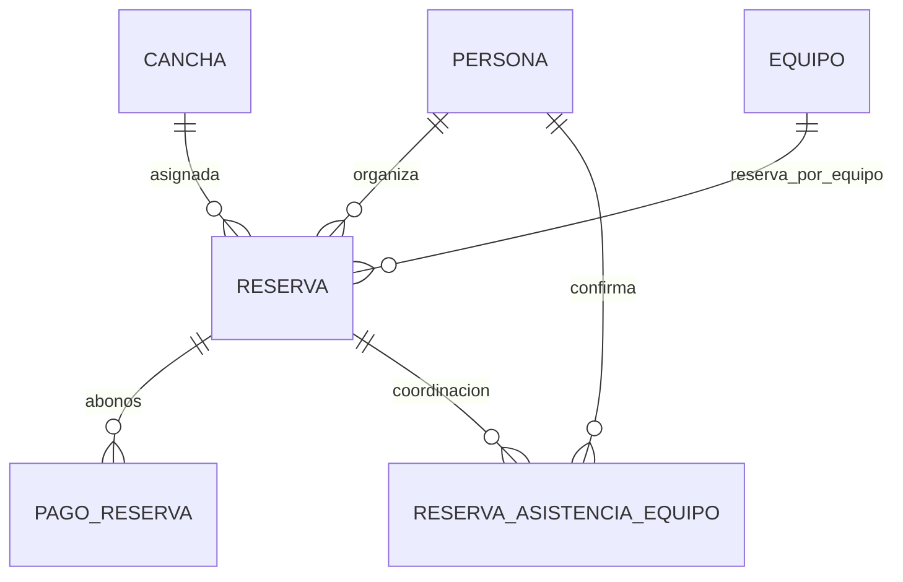
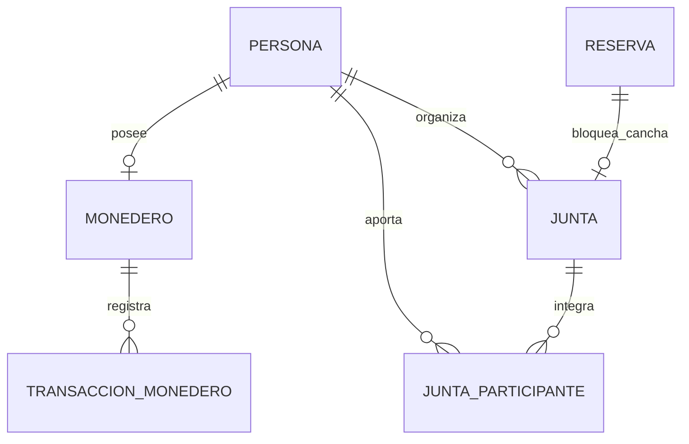
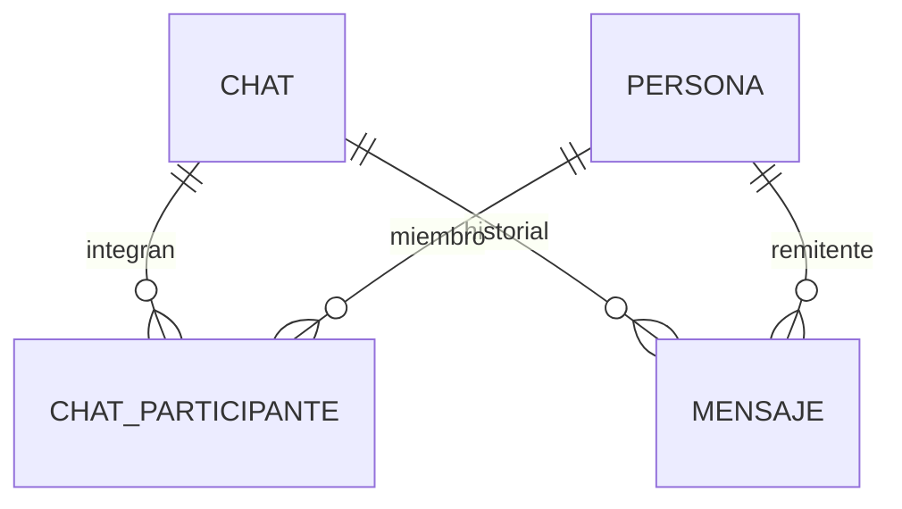
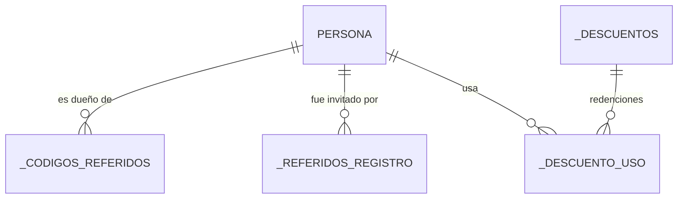
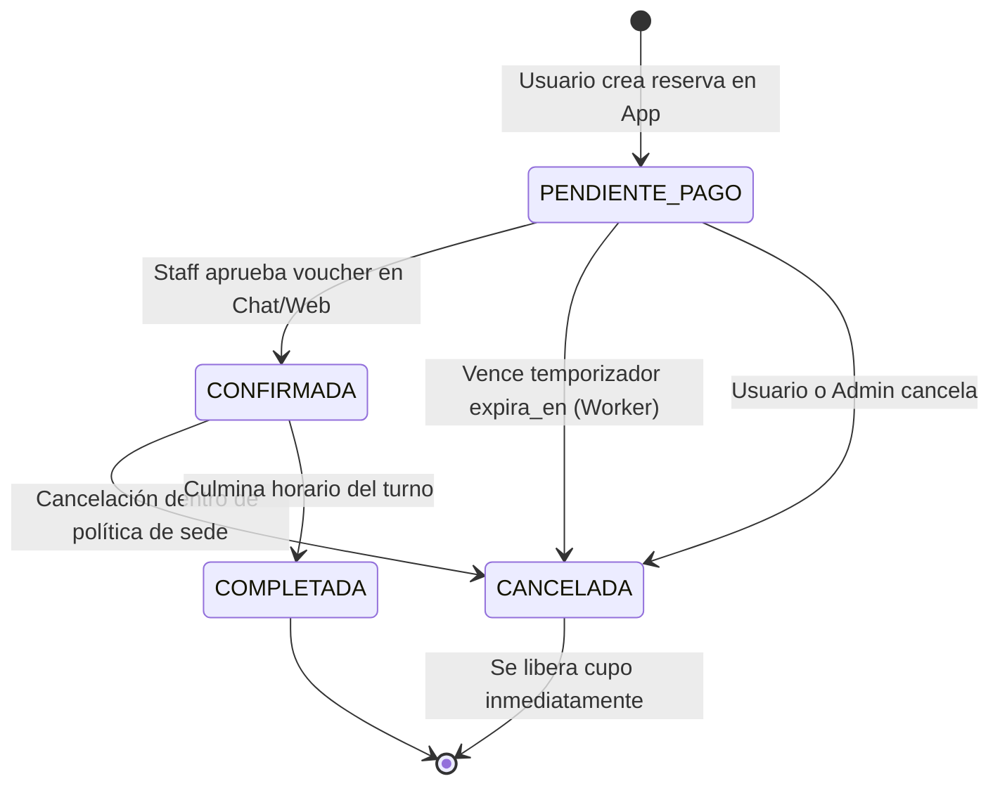

# Apuntes: Modelo Relacional de Base de Datos (PostgreSQL) - "Separa Altoke"

bien

Este documento detalla la arquitectura y el esquema relacional de base de datos (PostgreSQL 15+) para la plataforma **"Separa Altoke"**. Ha sido estructurado rigurosamente para dar soporte a todos los requerimientos y reglas operativas descritas en [`context/business_rules.md`](file:///home/juan/h/pdu/reservas-deportivas/context/business_rules.md).

Soporta multi-tenancy B2B2C, identidad única de personas con autenticación vía Google (OAuth 2.0 / OIDC) — las empresas no tienen login propio: son registradas por personas y accedidas por otras personas mediante contratos —, gestión de complejos y canchas con tarifas dinámicas, reservas individuales, por equipo y partidos abiertos (*juntas*), fraccionamiento de pagos con comprobantes externos, chat nativo con objetos interactivos, motor de referidos/monedero virtual interno (`_`) y auditoría inmutable.

---

## 1. Diagrama Entidad-Relación Global (Mermaid ERD)

A continuación se presenta el modelo conceptual-lógico maestro con las entidades principales y sus cardinalidades:



---

## 2. Convenciones Generales de Arquitectura y Base de Datos

1. **Motor y Dialecto:** PostgreSQL 15+.
2. **Llaves Primarias (PK):** `UUID v4` (`gen_random_uuid()` o extensión `uuid-ossp`) en todas las entidades transaccionales para escalabilidad distribuida y seguridad en rutas de la app móvil. En tablas geográficas maestras (Ubigeo) se emplean los códigos oficiales del INEI (`VARCHAR(2)`, `VARCHAR(4)`, `VARCHAR(6)`).
3. **Zonas Horarias (Timezones):** Todas las marcas temporales (`TIMESTAMPTZ`) deben persistirse obligatoriamente en formato **UTC**. La conversión a hora local peruana (`America/Lima`, UTC-5) se delega exclusivamente a los clientes móviles/frontend.
4. **Monedas y Precisión Numérica:** Todas las tarifas, cuotas y saldos de monedero se modelan con `NUMERIC(10, 2)` para evitar pérdidas por redondeo en operaciones de división de cuotas.
5. **Identidad: solo personas autentican:**
   - La tabla `usuario` concentra las credenciales (emitidas por Google vía OAuth 2.0 / OIDC) y el rol de seguridad; cada `usuario` tiene una relación `1 a 1` con una `persona` (jugadores, administradores de empresa, personal de sede, técnicos).
   - Las `empresa` **no son sujetos de autenticación**: son entidades registradas por personas. Una persona accede a operar una empresa mediante un `contrato` (ej. `ADMIN_EMPRESA` para quien la registró, o `ADMIN_SEDE`/`RECEPCIONISTA` para el personal contratado), lo que elimina el login por empresa.
6. **Almacenamiento de Archivos Estáticos:** Las columnas tipo `comprobante_url`, `foto_perfil_url` y `logo_url` almacenan la URI pública o relativa gestionada por el almacenamiento interno (MinIO / File System) del servidor.
7. **Control Anticolisión Horaria:** La responsabilidad de evitar solapamientos en los turnos de una misma cancha (doble reserva) recae **exclusivamente en la lógica del backend**. No se utilizan restricciones matemáticas a nivel de motor de base de datos (como `EXCLUDE USING gist`) para mantener la flexibilidad del esquema y delegar estas validaciones a la capa de aplicación.

---

## 3. Diccionario de Datos por Dominios Funcionales

### Dominio 1: Geografía, Ubigeo y Parámetros Globales

#### `_pais`
Catálogo internacional de países soportados para el registro y normalización de números telefónicos.

| Columna | Tipo de Dato | Nulo | Descripción / Regla |
| :--- | :--- | :--- | :--- |
| `id` | `UUID` | NO (PK) | Identificador único (`gen_random_uuid()`). |
| `codigo_iso` | `VARCHAR(2)` | NO (UQ) | Código ISO alfa-2 (ej. `PE`). |
| `nombre` | `VARCHAR(100)` | NO | Nombre oficial del país (ej. `Perú`). |
| `prefijo_telefonico` | `VARCHAR(10)` | NO | Código de país para llamadas/SMS (ej. `+51`). |
| `longitud_celular_esperada` | `INT` | NO | Longitud estándar del número móvil local (ej. 9 dígitos para Perú). |
| `estado` | `BOOLEAN` | NO | Indica si el país está habilitado para operar (Default `TRUE`). |
| `created_at` | `TIMESTAMPTZ` | NO | Fecha y hora UTC de creación. |

#### `_ubigeo_departamento` / `_ubigeo_provincia` / `_ubigeo_distrito`
Estructura oficial del INEI para geolocalización y segmentación de sedes y usuarios en Perú.

- **`_ubigeo_departamento`**: `id VARCHAR(2) PK` (ej: `'15'` Lima), `nombre VARCHAR(100)`.
- **`_ubigeo_provincia`**: `id VARCHAR(4) PK` (ej: `'1501'` Lima), `departamento_id VARCHAR(2) FK`, `nombre VARCHAR(100)`.
- **`_ubigeo_distrito`**: `id VARCHAR(6) PK` (ej: `'150122'` Miraflores), `provincia_id VARCHAR(4) FK`, `nombre VARCHAR(100)`.

#### `_sistema_configuracion`
Configuración centralizada y parámetros operativos de la plataforma Separa Altoke.

| Columna | Tipo de Dato | Nulo | Descripción / Regla |
| :--- | :--- | :--- | :--- |
| `id` | `UUID` | NO (PK) | Identificador único. |
| `clave` | `VARCHAR(80)` | NO (UQ) | Clave única del parámetro (ej: `APP_MIN_VERSION_ANDROID`, `MAX_PENDING_PAYMENT_MINUTES`, `PLATFORM_FEE_PERCENTAGE`). |
| `valor` | `JSONB` | NO | Valor tipado o estructura de configuración. |
| `descripcion` | `TEXT` | SÍ | Detalle del propósito del parámetro. |
| `updated_at` | `TIMESTAMPTZ` | NO | Última modificación del parámetro. |

---

### Dominio 2: Identidad (Personas + Google), Empresas y Suscripciones B2B



#### `usuario`
Cuenta de autenticación global del sistema. Todo usuario es, indefectiblemente, una **persona física**; las empresas no poseen cuentas de acceso.

| Columna | Tipo de Dato | Nulo | Descripción / Regla |
| :--- | :--- | :--- | :--- |
| `id` | `UUID` | NO (PK) | Identificador único de autenticación. |
| `username` | `VARCHAR(50)` | NO (UQ) | Nombre de usuario público (handle) para invitaciones rápidas sin revelar el teléfono. |
| `codigo_referido` | `VARCHAR(6)` | NO (UQ) | Código hex único de 6 dígitos generado automáticamente para que el usuario invite amigos. |
| `referido_por_usuario_id`| `UUID` | SÍ (FK) | UUID de la persona (`usuario.id`) que invitó a este usuario. |
| `referido_por_empresa_id`| `UUID` | SÍ (FK) | UUID de la empresa (`empresa.id`) si el usuario se registró mediante un enlace de campaña B2B. |
| `email` | `VARCHAR(255)` | NO (UQ) | Correo electrónico validado (proveniente del proveedor de identidad). |
| `telefono` | `VARCHAR(30)` | SÍ (UQ) | Teléfono normalizado con prefijo internacional. |
| `google_sub` | `VARCHAR(255)` | SÍ (UQ) | Identificador estable `sub` del token OIDC de Google (Claim de Google Identity Services). |
| `password_hash` | `VARCHAR(255)` | SÍ | Hash de contraseña (Argon2id o BCrypt). Nulo para cuentas creadas exclusivamente con login de Google. |
| `proveedor_auth` | `VARCHAR(20)` | NO | Método de acceso: `GOOGLE` (default) o `LOCAL` (contraseña, para cuentas de prueba/administrativas). |
| `rol` | `VARCHAR(20)` | NO | Rol base del sistema: `ADMIN` (platform), `PLAYER` (persona registrada). Los permisos sobre empresas/sedes no viven aquí: se derivan de los `contrato` vigentes. |
| `is_active` | `BOOLEAN` | NO | Estado de la cuenta (Default `TRUE`). |
| `email_verificado`| `BOOLEAN` | NO | Flag de verificación de correo (Google ya lo entrega verificado; Default `FALSE` hasta confirmar). |
| `telefono_verificado` | `BOOLEAN` | NO | Flag de validación de número de teléfono vía SMS (Default `FALSE`). |
| `ultimo_acceso_en` | `TIMESTAMPTZ` | SÍ | Último inicio de sesión exitoso vía Google. |
| `reset_password_token`| `VARCHAR(255)`| SÍ | Hash del token de recuperación de contraseña. |
| `reset_password_expires_at`| `TIMESTAMPTZ`| SÍ | Expiración del token de recuperación. |
| `created_at` | `TIMESTAMPTZ` | NO | Fecha de registro en el sistema. |
| `updated_at` | `TIMESTAMPTZ` | NO | Fecha de última actualización. |

> **Flujo de login (Google OAuth 2.0 / OIDC):** la app móvil obtiene un ID Token de Google (Google Identity Services / Sign-In with Google), el backend valida firma, `aud`, `iss` y `exp`, y hace *upsert* por `google_sub`: si no existe, crea `usuario` + `persona` (con nombres/email del perfil Google); si existe, emite el JWT propio de la sesión. Nunca circula la contraseña de Google.

#### `usuario_dispositivo`
Tabla para registrar los dispositivos físicos o navegadores de un usuario, vital para el envío de Notificaciones Push (FCM / APNs). Un usuario puede tener sesión activa en múltiples dispositivos.

| Columna | Tipo de Dato | Nulo | Descripción / Regla |
| :--- | :--- | :--- | :--- |
| `id` | `UUID` | NO (PK) | Identificador del registro del dispositivo. |
| `usuario_id` | `UUID` | NO (FK) | Dueño del dispositivo (`usuario.id`). |
| `fcm_token` | `VARCHAR(500)` | NO (UQ) | Token de Firebase Cloud Messaging (o APNs) para enviar notificaciones push. |
| `plataforma` | `VARCHAR(20)` | NO | Sistema operativo: `ANDROID`, `IOS`, `WEB`. |
| `modelo` | `VARCHAR(100)` | SÍ | Modelo del dispositivo (ej. `iPhone 14`, `Samsung S23`). Ayuda a auditoría de sesiones. |
| `is_active` | `BOOLEAN` | NO | Estado del token. Si FCM reporta error de "token expirado", se marca en `FALSE`. (Default `TRUE`). |
| `ultimo_uso_en`| `TIMESTAMPTZ`| NO | Fecha del último login o refresco de token en este dispositivo. |
| `created_at` | `TIMESTAMPTZ` | NO | Fecha de registro del dispositivo. |
| `updated_at` | `TIMESTAMPTZ` | NO | Fecha de última actualización. |


#### `persona`
Perfil físico del usuario: toda entidad que autenticando es una persona (jugadores, organizadores, árbitros, personal de sedes y administradores de empresas).

| Columna | Tipo de Dato | Nulo | Descripción / Regla |
| :--- | :--- | :--- | :--- |
| `id` | `UUID` | NO (PK) | Identificador del perfil físico. |
| `usuario_id` | `UUID` | NO (FK, UQ)| Vínculo 1 a 1 con `usuario.id`. |
| `nombres` | `VARCHAR(100)` | NO | Nombres del usuario (precargados desde el perfil de Google, editables). |
| `apellidos` | `VARCHAR(100)` | NO | Apellidos paterno y materno. |
| `tipo_documento` | `VARCHAR(20)` | NO | Tipo: `DNI`, `CE`, `PASAPORTE`. |
| `numero_documento`| `VARCHAR(30)` | NO (UQ) | Número de documento de identidad oficial. |
| `foto_perfil_url`| `VARCHAR(500)` | SÍ | Ruta en almacenamiento interno (MinIO/FS); se precarga con la foto de Google. |
| `_partidos_completados` | `INT` | NO | Conteo estadístico de reservas que el usuario concretó exitosamente (Default `0`). |
| `created_at` | `TIMESTAMPTZ` | NO | Fecha de creación del perfil. |
| `updated_at` | `TIMESTAMPTZ` | NO | Fecha de última modificación. |

#### `empresa`
Entidad jurídica comercial propietaria de los complejos y canchas deportivas. **No es un sujeto de autenticación**: la empresa no tiene usuario ni login propio. La registra una `persona` (quien obtiene automáticamente un `contrato` con rol `ADMIN_EMPRESA`) y otras personas acceden a operarla mediante contratos.

| Columna | Tipo de Dato | Nulo | Descripción / Regla |
| :--- | :--- | :--- | :--- |
| `id` | `UUID` | NO (PK) | Identificador de la empresa. |
| `creada_por_persona_id` | `UUID` | NO (FK) | Persona física que registró la empresa (`persona.id`). |
| `share_token` | `VARCHAR(100)` | NO (UQ) | Token único sin prefijo usado para generar enlaces públicos de invitación a campañas de referidos. |
| `ruc` | `VARCHAR(20)` | NO (UQ) | Registro Único de Contribuyentes (Perú) o Tax ID. |
| `razon_social` | `VARCHAR(200)` | NO | Razón social inscrita en SUNAT. |
| `nombre_comercial`| `VARCHAR(200)` | NO | Nombre público con el que se conoce a la marca. |
| `estado_aprobacion` | `VARCHAR(30)` | NO | `PENDIENTE`, `APROBADA`, `RECHAZADA` (Default `PENDIENTE`). Regula visibilidad en la plataforma. |
| `contacto_legal`| `VARCHAR(150)` | SÍ | Nombre del representante legal o titular. |
| `telefono_contacto` | `VARCHAR(30)` | NO | Teléfono comercial de atención. |
| `email_contacto`| `VARCHAR(255)` | NO | Email para notificaciones y facturación. |
| `logo_url` | `VARCHAR(500)` | SÍ | Ruta al logotipo comercial. |
| `terminos_condiciones` | `TEXT` | SÍ | Términos y condiciones propios de la empresa para reservas. |
| `created_at` | `TIMESTAMPTZ` | NO | Fecha de registro corporativo. |
| `updated_at` | `TIMESTAMPTZ` | NO | Fecha de actualización. |

#### `_plan_suscripcion`
Planes de suscripción SaaS para las empresas aliadas.

| Columna | Tipo de Dato | Nulo | Descripción / Regla |
| :--- | :--- | :--- | :--- |
| `id` | `UUID` | NO (PK) | Identificador del plan. |
| `nombre` | `VARCHAR(100)` | NO | Nombre del plan (ej. `Básico`, `Pro`, `Premium Club`). |
| `descripcion` | `TEXT` | SÍ | Alcance y detalles de cobertura. |
| `precio_mensual` | `NUMERIC(10,2)` | NO | Costo mensual en moneda local (PEN). |
| `precio_anual` | `NUMERIC(10,2)` | NO | Costo anual con descuento promocional. |
| `max_sedes` | `INT` | NO | Límite de sedes permitidas (ej. 1, 3, ilimitado). |
| `max_canchas` | `INT` | NO | Límite de canchas operables en simultáneo. |
| `beneficios` | `JSONB` | NO | Lista de flags y características habilitadas. |
| `is_active` | `BOOLEAN` | NO | Indica si el plan está disponible comercialmente. |
| `created_at` | `TIMESTAMPTZ` | NO | Fecha de creación del plan. |

#### `suscripcion_empresa`
Gestión de membresías y vigencia operativa del complejo en la plataforma.

| Columna | Tipo de Dato | Nulo | Descripción / Regla |
| :--- | :--- | :--- | :--- |
| `id` | `UUID` | NO (PK) | Identificador de la suscripción. |
| `empresa_id` | `UUID` | NO (FK) | Referencia a `empresa.id`. |
| `plan_id` | `UUID` | NO (FK) | Referencia a `_plan_suscripcion.id`. |
| `fecha_inicio` | `TIMESTAMPTZ` | NO | Inicio del período activo. |
| `fecha_fin` | `TIMESTAMPTZ` | NO | Fin de vigencia del período contratado. |
| `estado` | `VARCHAR(30)` | NO | `ACTIVA`, `VENCIDA`, `CANCELADA`, `PENDIENTE_PAGO`. |
| `auto_renovacion`| `BOOLEAN` | NO | Indicador de renovación pactada (Default `FALSE`). |
| `comprobante_url`| `VARCHAR(500)` | SÍ | Constancia de pago de la suscripción B2B. |
| `created_at` | `TIMESTAMPTZ` | NO | Registro de la suscripción. |
| `updated_at` | `TIMESTAMPTZ` | NO | Última modificación de estado. |

---

### Dominio 3: Sedes, Personal de Sede y Servicios Complementarios



#### `sede`
Complejos deportivos físicos operados por una empresa.

| Columna | Tipo de Dato | Nulo | Descripción / Regla |
| :--- | :--- | :--- | :--- |
| `id` | `UUID` | NO (PK) | Identificador de la sede. |
| `empresa_id` | `UUID` | NO (FK) | Empresa matriz propietaria (`empresa.id`). |
| `ubigeo_distrito_id` | `VARCHAR(6)` | NO (FK) | Distrito INEI de localización (`_ubigeo_distrito.id`). |
| `nombre` | `VARCHAR(150)` | NO | Nombre del local (ej. `Sede Los Olivos - Triple Doble`). |
| `direccion` | `VARCHAR(255)` | NO | Dirección física completa. |
| `referencia` | `VARCHAR(255)` | SÍ | Indicaciones para llegar al local. |
| `latitud` | `DOUBLE PRECISION` | NO | Coordenada GPS latitud (para motor de cercanía). |
| `longitud` | `DOUBLE PRECISION` | NO | Coordenada GPS longitud (para motor de cercanía). |
| `maps_url` | `VARCHAR(500)` | SÍ | Enlace de Google Maps (Beneficio de Cuenta Premium). |
| `telefono` | `VARCHAR(30)` | NO | Teléfono de recepción o WhatsApp de soporte. |
| `email` | `VARCHAR(255)` | SÍ | Correo electrónico de la sede. |
| `politica_cancelacion` | `TEXT` | SÍ | Políticas de penalidad, tolerancia y devoluciones. |
| `horas_limite_cancelacion` | `INT` | NO | Horas mínimas previas requeridas para cancelar sin penalidad (Default `24`). |
| `max_horas_reserva_continua` | `INT` | NO | Límite de horas consecutivas que un cliente puede reservar (Default `2`). |
| `reserva_minutos_espera` | `INT` | NO | Tiempo límite (minutos) para confirmar pago antes de liberar la reserva en PENDING (ej. `15`, `30`, `1440`). |
| `tipo_adelanto_requerido`| `VARCHAR(20)`| NO | Regla de cobro: `PORCENTAJE`, `MONTO_FIJO`, `NINGUNO`. |
| `valor_adelanto_requerido`| `NUMERIC(10,2)`| NO | Valor del adelanto. Si el tipo es `NINGUNO`, debe ser `0.00`. |
| `estado` | `VARCHAR(20)` | NO | `ACTIVA`, `INACTIVA` (Default `ACTIVA`). |
| `created_at` | `TIMESTAMPTZ` | NO | Fecha de registro del complejo. |
| `updated_at` | `TIMESTAMPTZ` | NO | Fecha de modificación. |

#### `sede_horario_atencion`
Horarios generales operativos de la sede por día de la semana. La disponibilidad máxima de cualquier cancha está delimitada por estos horarios.

| Columna | Tipo de Dato | Nulo | Descripción / Regla |
| :--- | :--- | :--- | :--- |
| `id` | `UUID` | NO (PK) | Identificador del horario. |
| `sede_id` | `UUID` | NO (FK) | Sede deportiva (`sede.id`). |
| `dia_semana` | `INT` | NO | Día calendario: `0` (Lunes) a `6` (Domingo). |
| `hora_apertura` | `TIME` | NO | Hora a la que abre el local. |
| `hora_cierre` | `TIME` | NO | Hora a la que cierra el local. |

#### `sede_excepcion_horario`
Reglas que sobreescriben el horario de atención general (ej. feriados cerrados, o domingos excepcionales abiertos).

| Columna | Tipo de Dato | Nulo | Descripción / Regla |
| :--- | :--- | :--- | :--- |
| `id` | `UUID` | NO (PK) | Identificador de la excepción. |
| `sede_id` | `UUID` | NO (FK) | Sede deportiva (`sede.id`). |
| `fecha_excepcion` | `DATE` | NO | Día específico (ej. `2026-12-25`). |
| `estado_operativo` | `VARCHAR(20)` | NO | `CERRADO` (feriado) o `ABIERTO_ESPECIAL`. |
| `hora_apertura` | `TIME` | SÍ | Hora de apertura excepcional (Nulo si está cerrado). |
| `hora_cierre` | `TIME` | SÍ | Hora de cierre excepcional (Nulo si está cerrado). |
| `descripcion` | `VARCHAR(255)` | SÍ | Motivo visible al usuario (ej. "Mantenimiento anual", "Feriado Navideño"). |

#### `contrato`
Vínculo de acceso/colaboración entre una `persona` y una `empresa` o una de sus `sedes`. Es el **único mecanismo por el cual una persona opera una empresa**: las empresas no inician sesión, siempre actúa una persona física amparada en un contrato vigente (Regla D.7 de business rules).

| Columna | Tipo de Dato | Nulo | Descripción / Regla |
| :--- | :--- | :--- | :--- |
| `id` | `UUID` | NO (PK) | Identificador del contrato. |
| `empresa_id` | `UUID` | NO (FK) | Empresa contratante (`empresa.id`). Siempre requerido: todo acceso laboral opera bajo un paraguas de empresa. |
| `sede_id` | `UUID` | SÍ (FK) | Alcance: Si es `NULL`, el rol aplica a **todas** las sedes de la empresa. Si tiene un `UUID`, el rol aplica **exclusivamente** a esa sede. |
| `persona_id` | `UUID` | NO (FK) | Trabajador o colaborador (`persona.id`). |
| `rol` | `VARCHAR(40)` | NO | Privilegios de acceso: `ADMINISTRADOR`, `RECEPCIONISTA`, `OPERADOR_MANTENIMIENTO`. |
| `otorgado_por` | `UUID` | NO (FK) | Persona (`persona.id`) que creó el contrato (debe ser el creador de la empresa o un `ADMINISTRADOR` global). |
| `fecha_inicio` | `DATE` | NO | Inicio de labores. |
| `fecha_fin` | `DATE` | SÍ | Término del contrato (nulo si es indefinido). |
| `is_active` | `BOOLEAN` | NO | Determina si tiene acceso vigente (Default `TRUE`). |
| `created_at` | `TIMESTAMPTZ` | NO | Fecha de creación del registro. |

#### `_servicio` y `sede_servicio`
Catálogo de comodidades e infraestructura adicional en el complejo.

- **`_servicio`**: Catálogo general **gestionado exclusivamente por los administradores de la plataforma** (`id UUID PK`, `nombre VARCHAR(100) UQ` ej. *Estacionamiento*, *Duchas con agua caliente*, *Quiosco / Bar*, *WiFi*, *Parrilla / BBQ*, `icono VARCHAR(100)`, `categoria VARCHAR(50)`). Las empresas no pueden crear texto libre aquí, solo elegir de esta lista curada.
- **`sede_servicio`**: Vínculo M:N entre sede y servicio (`id UUID PK`, `sede_id UUID FK`, `_servicio_id UUID FK`, `es_gratuito BOOLEAN`, `costo_adicional NUMERIC(10,2)`, `descripcion VARCHAR(255)`).

#### `detalle_particular_sede`
Políticas internas y normas particulares redactadas por la empresa para el uso de sus instalaciones.

| Columna | Tipo de Dato | Nulo | Descripción / Regla |
| :--- | :--- | :--- | :--- |
| `id` | `UUID` | NO (PK) | Identificador de la regla. |
| `sede_id` | `UUID` | NO (FK) | Sede deportiva (`sede.id`). |
| `titulo` | `VARCHAR(150)` | NO | Título o regla (ej. *Calzado obligatorio*, *Tolerancia de inicio*). |
| `descripcion` | `TEXT` | NO | Texto detallado (ej. *Prohibido el uso de choperas o toperoles de metal*). |
| `orden` | `INT` | NO | Posición para visualización secuencial en la app móvil. |
| `created_at` | `TIMESTAMPTZ` | NO | Fecha de creación. |

#### `sede_saldo_cliente`
Libreta de apuntes (saldos a favor) gestionada por la sede. Este saldo no es dinero real manejado por la plataforma, sino un compromiso interno de la sede hacia el cliente.

| Columna | Tipo de Dato | Nulo | Descripción / Regla |
| :--- | :--- | :--- | :--- |
| `id` | `UUID` | NO (PK) | Identificador del registro. |
| `sede_id` | `UUID` | NO (FK) | Sede deudora (`sede.id`). |
| `persona_id` | `UUID` | NO (FK) | Cliente acreedor (`persona.id`). |
| `monto_a_favor` | `NUMERIC(10,2)` | NO | Monto adeudado en PEN. |
| `ultimo_movimiento` | `TIMESTAMPTZ` | NO | Fecha de la última alteración del saldo. |

#### `sede_lista_negra`
Bloqueos de clientes problemáticos (ej. peleas, inasistencias) a discreción de la sede.

| Columna | Tipo de Dato | Nulo | Descripción / Regla |
| :--- | :--- | :--- | :--- |
| `id` | `UUID` | NO (PK) | Identificador del bloqueo. |
| `sede_id` | `UUID` | NO (FK) | Sede que bloquea (`sede.id`). |
| `persona_id` | `UUID` | NO (FK) | Cliente bloqueado (`persona.id`). |
| `motivo` | `TEXT` | NO | Razón interna del bloqueo. |
| `fecha_bloqueo` | `TIMESTAMPTZ` | NO | Fecha de aplicación de la restricción. |

---

### Dominio 4: Canchas, Bloqueos, Tarifas Dinámicas y Promociones



#### `_deporte`
Catálogo maestro de deportes gestionado por la administración de la plataforma (ej. Fútbol, Pádel, Básquet).

| Columna | Tipo de Dato | Nulo | Descripción / Regla |
| :--- | :--- | :--- | :--- |
| `id` | `UUID` | NO (PK) | Identificador del deporte. |
| `nombre` | `VARCHAR(100)` | NO | Nombre oficial (ej. `FÚTBOL`). |
| `is_active` | `BOOLEAN` | NO | Indica si el deporte está habilitado (Default `TRUE`). |

#### `cancha`
Espacio deportivo individual dentro de una sede. **Regla de multideporte**: Una fila de cancha pertenece a un único deporte. Si un espacio físico alberga múltiples deportes, la empresa registra una cancha por cada deporte y las vincula mediante `cancha_solapamiento`.

| Columna | Tipo de Dato | Nulo | Descripción / Regla |
| :--- | :--- | :--- | :--- |
| `id` | `UUID` | NO (PK) | Identificador de la cancha. |
| `sede_id` | `UUID` | NO (FK) | Complejo deportivo al que pertenece (`sede.id`). |
| `nombre` | `VARCHAR(100)` | NO | Nombre identificador (ej. `Cancha 1 - Sintético Pro 5v5`). |
| `_deporte_id` | `UUID` | NO (FK) | Referencia al catálogo central (`_deporte.id`). |
| `modalidades` | `VARCHAR[]` | SÍ | Etiquetas de formato de juego elegidas a libertad por la empresa (ej. `["Fútbol 5", "Fútbol 7"]`). No se heredan de ninguna tabla maestra. |
| `caracteristicas` | `JSONB` | SÍ | Cualidades físicas en formato libre (ej. material, techado, iluminación) definidas a libertad por la sede. |
| `is_active` | `BOOLEAN` | NO | Cancha operativa o dada de baja (Default `TRUE`). |
| `created_at` | `TIMESTAMPTZ` | NO | Fecha de creación. |
| `updated_at` | `TIMESTAMPTZ` | NO | Fecha de actualización. |

#### `cancha_foto`
Galería de imágenes de la cancha (iluminación, estado del campo, etc.).

| Columna | Tipo de Dato | Nulo | Descripción / Regla |
| :--- | :--- | :--- | :--- |
| `id` | `UUID` | NO (PK) | Identificador de la foto. |
| `cancha_id` | `UUID` | NO (FK) | Cancha a la que pertenece (`cancha.id`). |
| `foto_url` | `VARCHAR(500)` | NO | Ruta en almacenamiento interno (MinIO/FS). |
| `orden` | `INT` | NO | Secuencia para ordenar la galería (Default `0`). |
| `created_at` | `TIMESTAMPTZ` | NO | Fecha de subida. |

#### `cancha_solapamiento`
Relación de bloqueo cruzado para gestionar superposición de espacio (ej. una cancha de F7 compuesta por dos canchas de F5).

| Columna | Tipo de Dato | Nulo | Descripción / Regla |
| :--- | :--- | :--- | :--- |
| `id` | `UUID` | NO (PK) | Identificador del registro. |
| `cancha_principal_id` | `UUID` | NO (FK) | Cancha origen de la reserva (`cancha.id`). |
| `cancha_bloqueada_id` | `UUID` | NO (FK) | Cancha que queda inhabilitada físicamente (`cancha.id`). |

#### `cancha_horario`
Franjas horarias de atención y esquemas de tarifas dinámicas (día regular vs pico nocturno).

| Columna | Tipo de Dato | Nulo | Descripción / Regla |
| :--- | :--- | :--- | :--- |
| `id` | `UUID` | NO (PK) | Identificador de la tarifa horaria. |
| `cancha_id` | `UUID` | NO (FK) | Cancha vinculada (`cancha.id`). |
| `dia_semana` | `INT` | NO | Día calendario: `0` (Lunes) a `6` (Domingo). |
| `hora_inicio` | `TIME` | NO | Inicio del rango tarifario (ej. `08:00:00`). |
| `hora_fin` | `TIME` | NO | Fin del rango tarifario (ej. `18:00:00`). |
| `precio_por_hora` | `NUMERIC(10,2)` | NO | Tarifa estándar por hora en esa franja. |
| `recargo_luz` | `NUMERIC(10,2)` | NO | Suplemento por encendido de reflectores (Default `0.00`). |
| `is_active` | `BOOLEAN` | NO | Franja vigente (Default `TRUE`). |

#### `cancha_bloqueo`
Inhabilitación programada de canchas por mantenimiento, refacción interna o contingencias climáticas (Sección D.1 de business rules).

| Columna | Tipo de Dato | Nulo | Descripción / Regla |
| :--- | :--- | :--- | :--- |
| `id` | `UUID` | NO (PK) | Identificador del bloqueo. |
| `cancha_id` | `UUID` | NO (FK) | Cancha afectada (`cancha.id`). |
| `fecha_hora_inicio` | `TIMESTAMPTZ` | NO | Inicio de la indisponibilidad en UTC. |
| `fecha_hora_fin` | `TIMESTAMPTZ` | NO | Fin de la indisponibilidad en UTC. |
| `motivo` | `VARCHAR(50)` | NO | Causa: `MANTENIMIENTO`, `MAL_CLIMA`, `EVENTO_INTERNO`, `REPARACION`. |
| `descripcion` | `TEXT` | SÍ | Explicación detallada del trabajo o motivo. |
| `registrado_por` | `UUID` | NO (FK) | Personal de sede responsable del bloqueo (`persona.id`). |
| `created_at` | `TIMESTAMPTZ` | NO | Registro del bloqueo. |

#### `promocion_sede`
Campañas de descuento definidas y asumidas libremente por la empresa para incentivar horarios de baja demanda.

| Columna | Tipo de Dato | Nulo | Descripción / Regla |
| :--- | :--- | :--- | :--- |
| `id` | `UUID` | NO (PK) | Identificador de la promoción. |
| `sede_id` | `UUID` | NO (FK) | Sede deportiva donde aplica (`sede.id`). |
| `titulo` | `VARCHAR(150)` | NO | Nombre (ej. *20% Descuento Horario Diurno Lu-Mi*). |
| `descripcion` | `TEXT` | SÍ | Condiciones visibles al usuario. |
| `tipo_descuento` | `VARCHAR(20)` | NO | Tipo: `PORCENTAJE` o `MONTO_FIJO`. |
| `valor_descuento` | `NUMERIC(10,2)` | NO | Valor del descuento (ej. 20.00 para 20% o S/. 20). |
| `fecha_inicio` | `TIMESTAMPTZ` | NO | Inicio de la campaña. |
| `fecha_fin` | `TIMESTAMPTZ` | NO | Fin de la campaña. |
| `dias_semana` | `INT[]` | SÍ | Días en que aplica (ej. `{0, 1, 2}` para Lun, Mar, Mié). |
| `hora_inicio` | `TIME` | SÍ | Inicio de franja promocional (ej. `14:00:00`). |
| `hora_fin` | `TIME` | SÍ | Fin de franja promocional (ej. `17:00:00`). |
| `is_active` | `BOOLEAN` | NO | Estado de la promoción (Default `TRUE`). |
| `created_at` | `TIMESTAMPTZ` | NO | Fecha de creación. |

---

### Dominio 5: Equipos, Reservas y Pagos



#### `equipo` y `equipo_miembro`
Gestión de grupos consolidados de personas para reservas colectivas y torneos futuros.

- **`equipo`**: `id UUID PK`, `nombre VARCHAR(120) UQ`, `share_token VARCHAR(100) UQ`, `creador_id UUID FK persona.id`, `created_at TIMESTAMPTZ`, `updated_at TIMESTAMPTZ`.
- **`equipo_miembro`**: `id UUID PK`, `equipo_id UUID FK`, `persona_id UUID FK`, `rol VARCHAR(30)` (`CAPITAN`, `JUGADOR`), `fecha_ingreso TIMESTAMPTZ`, `is_active BOOLEAN`.

#### `reserva_asistencia_equipo`
Coordinación de asistencia (RSVP) dentro del chat de un equipo para una reserva específica.

| Columna | Tipo de Dato | Nulo | Descripción / Regla |
| :--- | :--- | :--- | :--- |
| `id` | `UUID` | NO (PK) | Identificador. |
| `reserva_id` | `UUID` | NO (FK) | Reserva compartida (`reserva.id`, origen `EQUIPO`). |
| `persona_id` | `UUID` | NO (FK) | Miembro del equipo que responde (`persona.id`). |
| `estado_asistencia` | `VARCHAR(30)` | NO | `ASISTIRA`, `NO_ASISTIRA`, `SIN_RESPUESTA` (Default `SIN_RESPUESTA`). |
| `updated_at` | `TIMESTAMPTZ` | NO | Última modificación de la respuesta. |

*(Nota: Los pagos internos no se registran aquí. El chat consulta la tabla `pago_reserva` para cruzar cuánto aportó realmente a la sede).*

#### `reserva`
Entidad transaccional central para el bloqueo y uso de una cancha deportiva.

| Columna | Tipo de Dato | Nulo | Descripción / Regla |
| :--- | :--- | :--- | :--- |
| `id` | `UUID` | NO (PK) | Identificador de la reserva. |
| `share_token` | `VARCHAR(100)` | NO (UQ) | Token aleatorio para compartir la vista de solo lectura de la reserva vía URL pública. |
| `cancha_id` | `UUID` | NO (FK) | Cancha reservada (`cancha.id`). |
| `tipo_origen` | `VARCHAR(20)` | NO | Origen: `INDIVIDUAL` (persona), `EQUIPO`. |
| `persona_organizadora_id` | `UUID` | NO (FK) | Persona física titular de la transacción (`persona.id`). |
| `equipo_id` | `UUID` | SÍ (FK) | Si el origen es `EQUIPO`, referencia al `equipo.id`. |
| `fecha_reserva` | `DATE` | NO | Fecha del turno de juego. |
| `hora_inicio_solicitada` | `TIME` | NO | Hora de inicio original que pidió el cliente. |
| `hora_fin_solicitada` | `TIME` | NO | Hora de término original que pidió el cliente. |
| `hora_inicio` | `TIME` | NO | Hora de inicio **efectiva**. Si hay promociones (ej. "+1 hora gratis"), se extiende para bloquear la cancha sin alterar la hora solicitada. |
| `hora_fin` | `TIME` | NO | Hora de término **efectiva**. |
| `duracion_horas` | `NUMERIC(3,1)` | NO | Duración en horas (ej. `1.0`, `1.5`, `2.0`). |
| `precio_hora_historico` | `NUMERIC(10,2)` | NO | **Fotocopia de precio pactado**: tarifa horaria congelada al crear la reserva (Regla D.5). |
| `precio_total_cancha` | `NUMERIC(10,2)` | NO | Subtotal pactado antes de descuentos. |
| `descuento_promocion_empresa` | `NUMERIC(10,2)` | NO | Descuento aplicado por promoción de la sede (Default `0.00`). |
| `descuento_cupon_plataforma` | `NUMERIC(10,2)` | NO | Descuento aplicado por cupón Separa Altoke `_descuentos` (Default `0.00`). |
| `monto_total_final` | `NUMERIC(10,2)` | NO | Monto líquido a liquidar: $\text{precio\_total} - \text{descuentos}$. |
| `_saldo_pendiente` | `NUMERIC(10,2)` | NO | Saldo pendiente por pagar (se descuenta con cada `pago_reserva` aprobado). |
| `estado` | `VARCHAR(30)` | NO | Estados: `PENDIENTE_PAGO`, `CONFIRMADA`, `CANCELADA`, `COMPLETADA`. |
| `expira_en` | `TIMESTAMPTZ` | SÍ | **Temporizador de liberación**: límite UTC para adjuntar comprobante antes de cancelar y liberar cancha (ej. 15-30 min). |
| `confirmado_en` | `TIMESTAMPTZ` | SÍ | Fecha y hora UTC en que el recepcionista aprueba el pago y asegura la reserva. |
| `cancelado_por` | `UUID` | SÍ (FK) | Persona o admin que ejecutó la cancelación (`persona.id`). |
| `motivo_cancelacion` | `TEXT` | SÍ | Razón detallada de la cancelación. |
| `cancelado_en` | `TIMESTAMPTZ` | SÍ | Fecha y hora UTC en que se canceló. |
| `created_at` | `TIMESTAMPTZ` | NO | Fecha y hora de creación de la reserva. |
| `updated_at` | `TIMESTAMPTZ` | NO | Fecha y hora de última modificación. |

#### `pago_reserva`
Soporta liquidaciones completas o pagos parciales / divididos por persona para una reserva.

| Columna | Tipo de Dato | Nulo | Descripción / Regla |
| :--- | :--- | :--- | :--- |
| `id` | `UUID` | NO (PK) | Identificador del abono. |
| `reserva_id` | `UUID` | NO (FK) | Reserva que se abona (`reserva.id`). |
| `persona_id` | `UUID` | NO (FK) | Persona que efectúa el desembolso (`persona.id`). |
| `monto` | `NUMERIC(10,2)` | NO | Monto abonado en PEN. |
| `metodo_pago` | `VARCHAR(40)` | NO | Medio: `TRANSFERENCIA_EXTERNA`, `YAPE`, `PLIN`, `EFECTIVO`, `MONEDERO_INTERNO`. |
| `comprobante_url` | `VARCHAR(500)` | SÍ | Captura de pantalla o PDF del voucher (MinIO/FS). |
| `estado` | `VARCHAR(20)` | NO | Estado del pago: `PENDIENTE`, `APROBADO`, `RECHAZADO`, `REEMBOLSADO`. |
| `revisado_por` | `UUID` | SÍ (FK) | Personal de sede que verificó el abono (`persona.id`). |
| `revisado_en` | `TIMESTAMPTZ` | SÍ | Momento de la aprobación o rechazo en UTC. |
| `motivo_rechazo` | `TEXT` | SÍ | Motivo informado al usuario si el voucher es inválido o no legible. |
| `created_at` | `TIMESTAMPTZ` | NO | Momento en que el usuario registró el abono. |

---

### Dominio 6: Juntas (Partidos Abiertos) y Fintech (Monedero)



#### `monedero`
Billetera virtual interna del usuario en la plataforma. Maneja el saldo disponible para organizar o unirse a juntas.

| Columna | Tipo de Dato | Nulo | Descripción / Regla |
| :--- | :--- | :--- | :--- |
| `id` | `UUID` | NO (PK) | Identificador de la billetera. |
| `persona_id` | `UUID` | NO (FK, UQ) | Dueño de la billetera (`persona.id`). Relación 1 a 1. |
| `saldo_disponible` | `NUMERIC(10,2)` | NO | Dinero líquido disponible para gastar (Default `0.00`). |
| `saldo_retenido` | `NUMERIC(10,2)` | NO | Dinero bloqueado (en escrow) por participación en juntas en curso (Default `0.00`). |
| `created_at` | `TIMESTAMPTZ` | NO | Fecha de creación. |
| `updated_at` | `TIMESTAMPTZ` | NO | Fecha de última actualización. |

#### `transaccion_monedero`
Historial inmutable de movimientos financieros en la billetera.

| Columna | Tipo de Dato | Nulo | Descripción / Regla |
| :--- | :--- | :--- | :--- |
| `id` | `UUID` | NO (PK) | Identificador de la transacción. |
| `monedero_id` | `UUID` | NO (FK) | Billetera afectada (`monedero.id`). |
| `tipo_transaccion` | `VARCHAR(30)` | NO | `RECARGA` (ingreso manual), `APORTE_JUNTA` (retención), `REEMBOLSO_JUNTA` (liberación), `PAGO_RESERVA` (egreso final), `RETIRO` (egreso a banco). |
| `monto` | `NUMERIC(10,2)` | NO | Valor de la transacción (positivo). |
| `referencia_id` | `UUID` | SÍ | ID del documento asociado (ej. `junta.id` o `pago_reserva.id`). |
| `estado` | `VARCHAR(20)` | NO | `PENDIENTE`, `APROBADA`, `RECHAZADA`. |
| `created_at` | `TIMESTAMPTZ` | NO | Fecha de registro. |

#### `junta`
Partido abierto gestionado por la plataforma. Agrupa a múltiples jugadores desconocidos para financiar colectivamente una reserva de cancha.

| Columna | Tipo de Dato | Nulo | Descripción / Regla |
| :--- | :--- | :--- | :--- |
| `id` | `UUID` | NO (PK) | Identificador de la junta. |
| `share_token` | `VARCHAR(100)` | NO (UQ) | Token aleatorio para compartir el enlace público de invitación a la junta. |
| `reserva_id` | `UUID` | NO (FK, UQ)| Reserva bloqueada en estado `PENDIENTE_PAGO` (`reserva.id`). |
| `organizador_id` | `UUID` | NO (FK) | Jugador que creó la junta (`persona.id`). |
| `presupuesto_meta` | `NUMERIC(10,2)` | NO | Monto total a recaudar (costo de la cancha). |
| `cupos_totales` | `INT` | NO | Cantidad máxima de jugadores permitidos. |
| `cupos_disponibles`| `INT` | NO | Cupos libres actualmente. |
| `estado` | `VARCHAR(30)` | NO | `RECAUDANDO`, `CONFIRMADA` (meta lograda, paga a sede), `CANCELADA` (fracasó, reembolsa a monederos). |
| `created_at` | `TIMESTAMPTZ` | NO | Fecha de creación. |
| `updated_at` | `TIMESTAMPTZ` | NO | Fecha de actualización. |

#### `junta_participante`
Jugadores unidos a una junta y su aporte retenido.

| Columna | Tipo de Dato | Nulo | Descripción / Regla |
| :--- | :--- | :--- | :--- |
| `id` | `UUID` | NO (PK) | Identificador de participación. |
| `junta_id` | `UUID` | NO (FK) | Referencia a la `junta.id`. |
| `persona_id` | `UUID` | NO (FK) | Jugador unido (`persona.id`). |
| `aporte_monedero`| `NUMERIC(10,2)` | NO | Dinero retenido en el monedero del jugador para esta junta. |
| `fecha_ingreso` | `TIMESTAMPTZ` | NO | Fecha en la que se unió. |
| `created_at` | `TIMESTAMPTZ` | NO | Fecha de creación. |
| `updated_at` | `TIMESTAMPTZ` | NO | Fecha de actualización. |

---

### Dominio 7: Chat Nativo y Mensajería con Objetos Interactivos



#### `chat`
Canales de comunicación dentro de la app móvil.

| Columna | Tipo de Dato | Nulo | Descripción / Regla |
| :--- | :--- | :--- | :--- |
| `id` | `UUID` | NO (PK) | Identificador de la conversación. |
| `tipo_canal` | `VARCHAR(30)` | NO | Canales: `JUGADOR_JUGADOR` (directo 1-a-1), `EQUIPO` (interno del club), `JUGADOR_EMPRESA` (consultas y comprobantes a la sede). |
| `referencia_id` | `UUID` | SÍ | Identificador del contexto según el canal (ej. `equipo.id`, `sede.id`). |
| `created_at` | `TIMESTAMPTZ` | NO | Fecha de apertura del canal. |
| `updated_at` | `TIMESTAMPTZ` | NO | Último mensaje registrado (para ordenamiento en bandeja). |

#### `chat_participante`
Miembros vinculados a un canal de chat.

| Columna | Tipo de Dato | Nulo | Descripción / Regla |
| :--- | :--- | :--- | :--- |
| `id` | `UUID` | NO (PK) | Identificador de membresía en chat. |
| `chat_id` | `UUID` | NO (FK) | Canal de chat (`chat.id`). |
| `persona_id` | `UUID` | NO (FK) | Participante (`persona.id`). |
| `rol` | `VARCHAR(20)` | NO | Rol en el chat: `ADMIN`, `MIEMBRO`. |
| `ultimo_leido_en` | `TIMESTAMPTZ` | SÍ | Marca de tiempo del último mensaje visto. |
| `_no_leidos` | `INT` | NO | Contador de mensajes sin leer en badge móvil (Default `0`). |
| `joined_at` | `TIMESTAMPTZ` | NO | Fecha de unión a la conversación. |

#### `mensaje`
Mensajes tradicionales y **Objetos Interactivos** embebidos en el flujo de conversación.

| Columna | Tipo de Dato | Nulo | Descripción / Regla |
| :--- | :--- | :--- | :--- |
| `id` | `UUID` | NO (PK) | Identificador del mensaje. |
| `chat_id` | `UUID` | NO (FK) | Canal donde se envió (`chat.id`). |
| `remitente_id` | `UUID` | NO (FK) | Jugador o staff emisor (`persona.id`). |
| `tipo_mensaje` | `VARCHAR(30)` | NO | Formatos: `TEXTO`, `IMAGEN`, `AUDIO`, `COMPROBANTE_PAGO`, `REEMBOLSO`, `INVITACION`, `NOTIFICACION_RESERVA`. |
| `contenido_texto` | `TEXT` | SÍ | Contenido textual legible. |
| `archivo_url` | `VARCHAR(500)` | SÍ | Ruta en almacenamiento interno para audios o imágenes. |
| `datos_objeto` | `JSONB` | SÍ | **Estructura interactiva** (ver especificación abajo). |
| `created_at` | `TIMESTAMPTZ` | NO | Fecha y hora de envío en UTC. |

##### Esquema de `datos_objeto` (JSONB) por tipo interactivo:
- **`COMPROBANTE_PAGO`**:
  El cliente envía la evidencia del pago. Este mensaje entra en estado `PENDIENTE` y requiere que la empresa lo apruebe o rechace.
  ```json
  {
    "pago_id": "UUID",
    "monto": 60.00,
    "estado": "PENDIENTE | APROBADO | RECHAZADO",
    "comprobante_url": "https://storage.ddoso.com/receipts/r123.jpg",
    "revisado_por": "UUID"
  }
  ```
- **`REEMBOLSO`**:
  Mensaje emitido unilateralmente por la empresa para notificar la devolución de dinero. No requiere confirmación ni botones de "Aceptar" por parte del cliente.
  ```json
  {
    "pago_id_original": "UUID",
    "monto_reembolsado": 60.00,
    "motivo": "Cancelación por mal clima",
    "emitido_por": "UUID"
  }
  ```
- **`INVITACION`**:
  ```json
  {
    "meta_relacional": {
        "tipo": "EQUIPO | AMIGO",
        "id_relacion": "UUID"
    },
    "estado": "PENDIENTE | ACEPTADA | RECHAZADA"
  }
  ```
- **`NOTIFICACION_RESERVA`**:
  ```json
  {
    "reserva_id": "UUID",
    "cancha_nombre": "Cancha 1 - Sintético Pro 5v5",
    "sede_nombre": "Triple Doble",
    "fecha": "2026-09-04",
    "hora_inicio": "20:00",
    "hora_fin": "21:00",
    "monto_total": 120.00,
    "estado": "CONFIRMADA"
  }
  ```

---

### Dominio 7: Estrategias de Crecimiento, Referidos y Monedero Virtual (`_`)

El sistema debe proveer su propio ecosistema de lealtad ("Separa Altoke") transversal a todas las empresas para incentivar el registro y uso de la plataforma, reteniendo clientes y aumentando la frecuencia de juegos.



#### `_descuentos`
Cupones y reglas de descuento globales otorgados por la plataforma.

| Columna | Tipo de Dato | Nulo | Descripción / Regla |
| :--- | :--- | :--- | :--- |
| `id` | `UUID` | NO (PK) | Identificador del cupón. |
| `codigo` | `VARCHAR(50)` | NO (UQ) | Código alfanumérico para canjear en la app (ej. `PRIMERA-VEZ`). |
| `descripcion` | `TEXT` | SÍ | Descripción de la campaña. |
| `tipo_descuento` | `VARCHAR(20)` | NO | Tipo: `PORCENTAJE` o `MONTO_FIJO`. |
| `valor_descuento` | `NUMERIC(10,2)` | NO | Valor numérico (ej. 15.00 para 15% o S/. 15.00). |
| `monto_minimo_reserva` | `NUMERIC(10,2)` | NO | Importe mínimo de reserva para aplicar (Default `0.00`). |
| `monto_maximo_descuento` | `NUMERIC(10,2)` | SÍ | Tope de descuento en caso de ser porcentual (ej. max S/. 20.00). |
| `limite_usos_global` | `INT` | SÍ | Cupo máximo de canjes en la plataforma. |
| `_usos_actuales` | `INT` | NO | Conteo acumulado de canjes (Default `0`). |
| `limite_usos_por_usuario` | `INT` | NO | Máximo de veces que una persona puede usarlo (Default `1`). |
| `acumulable_con_promociones` | `BOOLEAN` | NO | **Regla D.8**: Define si puede sumarse a promociones locales de la empresa (Default `FALSE`). |
| `fecha_inicio` | `TIMESTAMPTZ` | NO | Inicio de vigencia del cupón. |
| `fecha_fin` | `TIMESTAMPTZ` | NO | Fin de vigencia del cupón. |
| `is_active` | `BOOLEAN` | NO | Estado de activación manual. |
| `created_at` | `TIMESTAMPTZ` | NO | Fecha de creación. |

#### `_descuento_uso`
Trazabilidad de cada cupón canjeado en una reserva particular.

| Columna | Tipo de Dato | Nulo | Descripción / Regla |
| :--- | :--- | :--- | :--- |
| `id` | `UUID` | NO (PK) | Identificador del canje. |
| `descuento_id` | `UUID` | NO (FK) | Cupón redimido (`_descuentos.id`). |
| `persona_id` | `UUID` | NO (FK) | Jugador que lo aprovechó (`persona.id`). |
| `reserva_id` | `UUID` | NO (FK) | Reserva donde se dedujo el monto (`reserva.id`). |
| `monto_descontado` | `NUMERIC(10,2)` | NO | Importe neto que se rebajó de la cuenta. |
| `fecha_uso` | `TIMESTAMPTZ` | NO | Fecha y hora UTC de la redención. |

#### `_programas_referidos`
Campañas activas del programa "Jugador invita Jugador" (Sección 1.C de business rules).

| Columna | Tipo de Dato | Nulo | Descripción / Regla |
| :--- | :--- | :--- | :--- |
| `id` | `UUID` | NO (PK) | Identificador del programa de incentivo. |
| `nombre` | `VARCHAR(150)` | NO | Nombre (ej. *Campaña Lanzamiento 2026*). |
| `descripcion` | `TEXT` | SÍ | Términos del beneficio. |
| `beneficio_referente_id` | `UUID` | SÍ (FK) | Cupón de descuento otorgado al promotor (`_descuentos.id`). |
| `beneficio_referido_id` | `UUID` | SÍ (FK) | Cupón de descuento otorgado al nuevo usuario (`_descuentos.id`). |
| `condicion_activacion` | `VARCHAR(50)` | NO | Evento disparador (ej. `PRIMER_PARTIDO_COMPLETADO`). |
| `fecha_inicio` | `TIMESTAMPTZ` | NO | Inicio del programa de recompensas. |
| `fecha_fin` | `TIMESTAMPTZ` | SÍ | Cierre del programa. |
| `is_active` | `BOOLEAN` | NO | Flag de activación. |
| `created_at` | `TIMESTAMPTZ` | NO | Fecha de registro. |

#### `_codigos_referidos`
Códigos personales autogenerados en el perfil de cada jugador (ej. `ALTOKE-JUAN77`).

| Columna | Tipo de Dato | Nulo | Descripción / Regla |
| :--- | :--- | :--- | :--- |
| `id` | `UUID` | NO (PK) | Identificador del código. |
| `persona_id` | `UUID` | NO (FK) | Dueño del código promotor (`persona.id`). |
| `programa_referido_id` | `UUID` | NO (FK) | Programa al que pertenece (`_programas_referidos.id`). |
| `codigo_unico` | `VARCHAR(50)` | NO (UQ) | Cadena única visible para compartir. |
| `_total_usos` | `INT` | NO | Total de jugadores que se han registrado con este código (Default `0`). |
| `created_at` | `TIMESTAMPTZ` | NO | Fecha de emisión. |

#### `_referidos_registro`
Seguimiento del embudo de conversión de usuarios referidos.

| Columna | Tipo de Dato | Nulo | Descripción / Regla |
| :--- | :--- | :--- | :--- |
| `id` | `UUID` | NO (PK) | Identificador del registro referido. |
| `codigo_referido_id` | `UUID` | NO (FK) | Código usado (`_codigos_referidos.id`). |
| `persona_referida_id` | `UUID` | NO (FK, UQ) | Nuevo jugador registrado (`persona.id`). |
| `estado` | `VARCHAR(30)` | NO | `REGISTRADO`, `PRIMER_PARTIDO_COMPLETADO`, `RECOMPENSA_ENTREGADA`. |
| `fecha_registro` | `TIMESTAMPTZ` | NO | Momento en que completó su registro. |
| `fecha_completado_partido` | `TIMESTAMPTZ` | SÍ | Momento en que culminó con éxito su primer turno. |
| `recompensa_entregada_en` | `TIMESTAMPTZ` | SÍ | Momento en que se entregaron los cupones de recompensa. |

#### `_campanas_marketing`
Notificaciones push, SMS o correos masivos dirigidos para incentivar franjas de baja ocupación.

| Columna | Tipo de Dato | Nulo | Descripción / Regla |
| :--- | :--- | :--- | :--- |
| `id` | `UUID` | NO (PK) | Identificador de la campaña. |
| `titulo` | `VARCHAR(150)` | NO | Asunto o título de la alerta. |
| `mensaje` | `TEXT` | NO | Cuerpo del mensaje persuasivo. |
| `canal` | `VARCHAR(20)` | NO | Canal: `PUSH`, `SMS`, `EMAIL`. |
| `segmento_filtro` | `JSONB` | NO | Criterios de segmentación (ej: distrito, deportes preferidos, jugadores inactivos > 15 días). |
| `programada_para` | `TIMESTAMPTZ` | NO | Fecha y hora UTC del disparo programado. |
| `estado` | `VARCHAR(20)` | NO | `BORRADOR`, `PROGRAMADA`, `ENVIADA`, `CANCELADA`. |
| `enviada_en` | `TIMESTAMPTZ` | SÍ | Momento real de la ejecución. |
| `created_at` | `TIMESTAMPTZ` | NO | Fecha de creación. |

---

### Dominio 8: Auditoría, Trazabilidad y Seguridad Multi-tenant

#### `auditoria_log`
Bitácora inmutable de eventos críticos para cumplimiento y resolución de disputas (Regla D.12 de business rules).

| Columna | Tipo de Dato | Nulo | Descripción / Regla |
| :--- | :--- | :--- | :--- |
| `id` | `UUID` | NO (PK) | Identificador del evento de auditoría. |
| `usuario_id` | `UUID` | SÍ (FK) | Usuario (persona) responsable (`usuario.id`). Nulo si fue una tarea automática del worker/cron. |
| `contrato_id` | `UUID` | SÍ (FK) | Si la acción se ejecutó operando una empresa/sede, contrato vigente bajo el cual se actuó (`contrato.id`). Base de la trazabilidad "persona actuando en nombre de empresa". |
| `sede_id` | `UUID` | SÍ (FK) | Sede deportiva donde ocurrió la acción (para aislamiento multi-tenant). |
| `accion` | `VARCHAR(50)` | NO | Acción: `CANCELACION_RESERVA`, `APROBACION_PAGO`, `RECHAZO_PAGO`, `MODIFICACION_TARIFA`, `BLOQUEO_CANCHA`, `ACCESO_SISTEMA`. |
| `tabla_afectada` | `VARCHAR(60)` | NO | Nombre físico de la tabla (ej. `reserva`, `cancha_horario`). |
| `registro_id` | `UUID` | NO | UUID del registro intervenido. |
| `datos_previos` | `JSONB` | SÍ | Snapshot del estado antes de la mutación. |
| `datos_nuevos` | `JSONB` | SÍ | Snapshot del estado resultante tras la mutación. |
| `ip_address` | `VARCHAR(45)` | SÍ | Dirección IPv4 o IPv6 del cliente. |
| `user_agent` | `TEXT` | SÍ | Identificador del dispositivo / versión de la app móvil. |
| `created_at` | `TIMESTAMPTZ` | NO | Marca temporal UTC inmutable (`now()`). |

---

## 4. Restricciones e Índices Críticos en PostgreSQL

### A. Validación de Anticolisión Horaria (Pasiva)
En congruencia con las reglas de negocio, la base de datos opera en modo pasivo respecto a los solapamientos de turnos (doble reserva). **No se utilizan restricciones matemáticas a nivel de motor** (como `EXCLUDE USING gist`) para bloquear empalmes horarios. 

La responsabilidad de leer el calendario, intersectar los rangos (`fecha_reserva + hora_inicio`) y rechazar o bloquear una reserva si la `cancha_id` ya está ocupada, recae **100% en la lógica de código del Backend**. 
Esto permite a la aplicación manejar solapamientos forzados (ej. un administrador reubicando un partido por mantenimiento o por lluvia) sin que la base de datos lance excepciones físicas rígidas ineludibles.

### B. Índices de Rendimiento Obligatorios

```sql
-- 1. Geoposicionamiento de sedes para búsqueda por cercanía
CREATE INDEX idx_sede_coordenadas ON sede (latitud, longitud) WHERE estado = 'ACTIVA';

-- 2. Búsqueda de disponibilidad horaria por cancha y fecha
CREATE INDEX idx_reserva_cancha_fecha ON reserva (cancha_id, fecha_reserva, estado);

-- 3. Barrido de tareas en segundo plano (Worker/Cron) para purgar reservas vencidas
CREATE INDEX idx_reserva_purga_expiracion ON reserva (expira_en) WHERE estado = 'PENDIENTE_PAGO';

-- 4. Búsqueda de partidos abiertos disponibles
CREATE INDEX idx_junta_disponible ON junta (deporte, estado) WHERE estado = 'ABIERTA';

-- 5. Chats activos ordenados por actividad reciente
CREATE INDEX idx_chat_updated_at ON chat (updated_at DESC);
CREATE INDEX idx_mensaje_chat_cronologico ON mensaje (chat_id, created_at ASC);

-- 6. Auditoría filtrada por sede y fecha
CREATE INDEX idx_auditoria_sede_fecha ON auditoria_log (sede_id, created_at DESC);

-- 7. Validación RBAC por contrato vigente (toda acción B2B pasa por aquí:
--    el middleware busca el contrato activo de la persona sobre la empresa/sede)
CREATE INDEX idx_contrato_persona_activa ON contrato (persona_id, empresa_id, sede_id) WHERE is_active = TRUE;

-- 8. Login por identidad de Google
CREATE UNIQUE INDEX idx_usuario_google_sub ON usuario (google_sub) WHERE google_sub IS NOT NULL;
```

---

## 5. Resumen de Estados Clave del Sistema


---